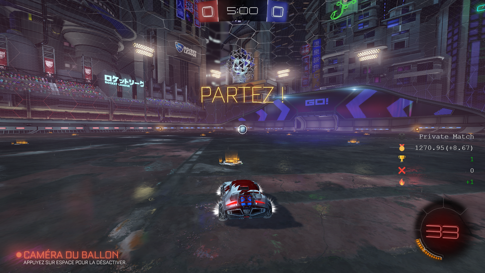
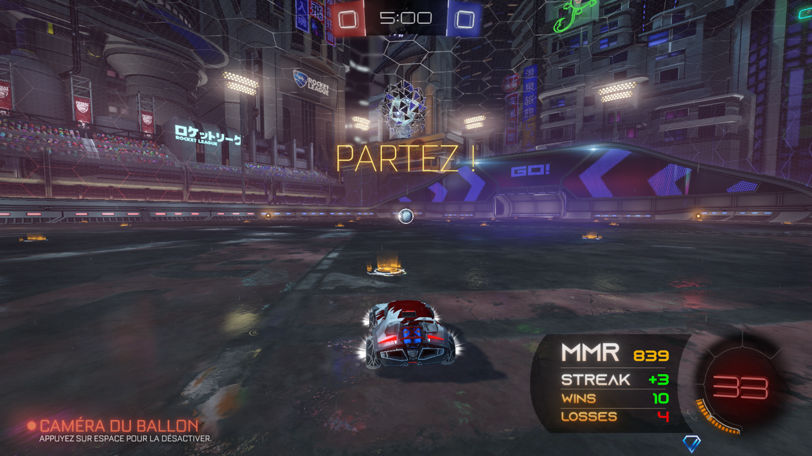
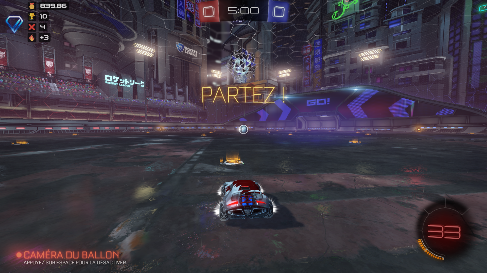
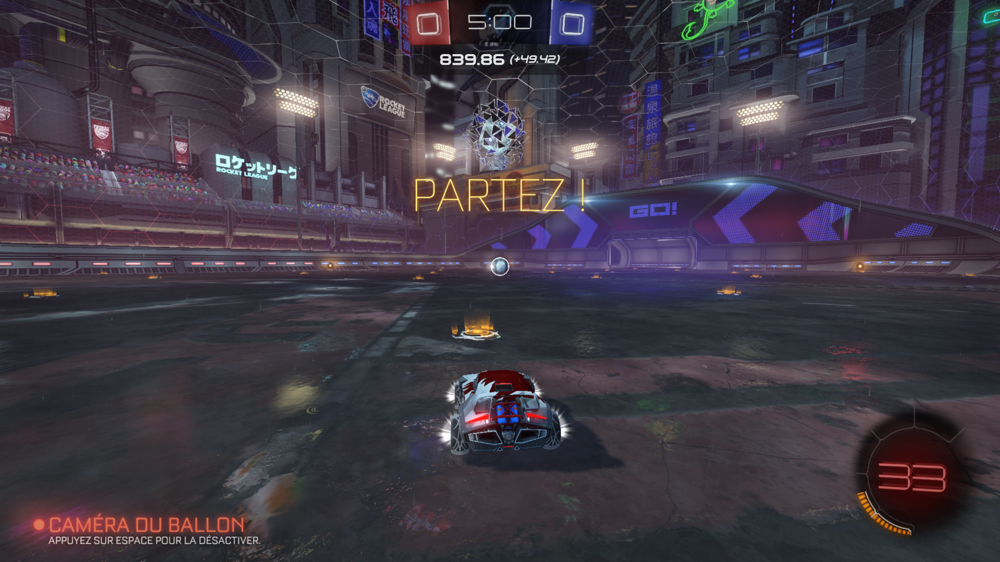

# RocketStats_overlay

Easily add an overlay to your OBS scene using only a Browser source.

Thanks to [Rimey](https://twitter.com/Rimey_) for the overlay video, and [Azonix Regular](https://www.dafont.com/azonix.font) for its font, from the Circle theme.

## Dependencies

To work, you need to install the following dependencies:
 - Bakkesmod: https://www.bakkesmod.com
 - RocketStats: https://bakkesplugins.com/plugins/view/30

## Installation

For the overlay to work, it must be placed in a particular location.
The `RocketStats_overlay` folder should be copied to the following path: `%appdata%\bakkesmod\bakkesmod\data\RocketStats`.

Now add a Browser source to your scene, check the local file option, and give the path of the `RocketStats_overlay\overlay.html` file of the previously copied folder.

__Note__: You can enter the path shown in the address bar of windows explorer to get there.

## Basic settings

The following settings can be found in the `RocketStats_overlay/config.json` file.

 - __delay__: Time between each rank change check (milliseconds).
 - __theme__: Name of the theme to load (leave empty to keep the default theme).
 - __mmrwchange__: Adds the difference with the previous MMR directly following the MMR.
 - __occasionnal__: Leave empty to display the images of the occasional modes (if none will display 'Unranked'), otherwise will display the image of the specified name.

For the settings specific to a theme, go to its folder and open the `config.json` file which groups its options in JSON format.

__Note__: Keep in mind that some settings can be forced by themes.

## Creating a theme

Here are the different elements that make up a theme:
```
theme_folder
├─── images
│    └─── background.png
├─── config.json
├─── script.js
└─── style.css
```

The themes are to be placed in the `RocketStats_overlay\themes` folder.
All the file are optional, take the themes provided as an example.

## Themes available

### Default


### Arubinu42


### Circle


### Horizontals


### Marker


### Verticals

